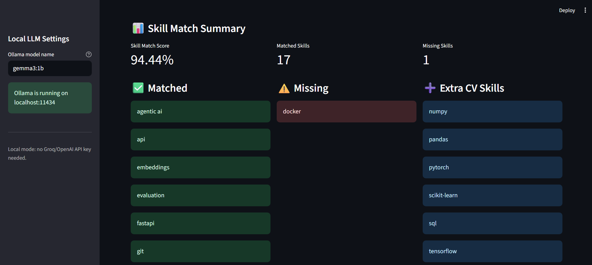
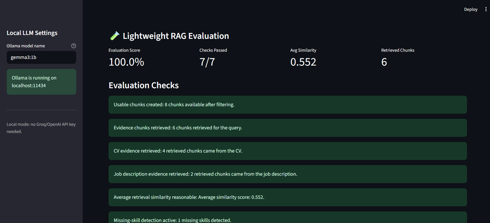
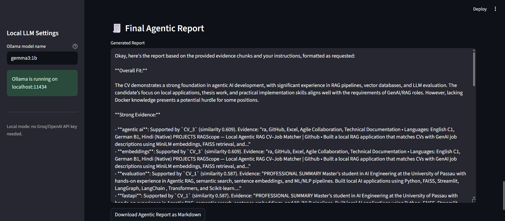

# RAGScope: Local Agentic RAG CV–Job Matcher

RAGScope is a local agentic RAG application that compares a CV against a GenAI/RAG job description and generates an evidence-grounded job-fit report.

The goal of this project is to make CV-job matching more transparent by showing which skills are strongly supported by retrieved CV evidence, which skills are weakly supported, and which job requirements are missing.

## Features

* Upload a CV as PDF
* Upload a job description as TXT
* Extract and clean document text
* Split documents into overlapping chunks
* Generate MiniLM sentence embeddings
* Retrieve relevant evidence using FAISS vector search
* Generate local reports using Ollama
* Use a LangGraph workflow for agentic analysis
* Separate strong evidence from weak listed skills
* Detect missing job requirements
* Filter unsupported/fake metrics from generated reports
* Run lightweight RAG evaluation checks
* Generate safe CV bullet ideas and interview explanations

## Tech Stack

* Python
* Streamlit
* sentence-transformers
* FAISS
* Ollama
* LangGraph
* pypdf
* requests

## Architecture

```text
CV PDF + Job Description TXT
        ↓
Text Extraction
        ↓
Text Cleaning + Chunking
        ↓
MiniLM Embeddings
        ↓
FAISS Vector Search
        ↓
Retrieved Evidence Chunks
        ↓
LangGraph Agent Workflow
        ↓
Ollama Local Report Generation
        ↓
Safety + Evidence Quality Checks
        ↓
Final Job-Fit Report
```

## LangGraph Workflow

The application uses a simple multi-step agentic workflow:

```text
Job Requirement Agent
        ↓
CV Evidence Agent
        ↓
Gap Analysis Agent
        ↓
Report Generation Agent
        ↓
Safety Checker Agent
```

## Lightweight Evaluation

RAGScope includes a lightweight evaluation panel that checks:

* Whether usable chunks were created
* Whether evidence chunks were retrieved
* Whether CV evidence was retrieved
* Whether job description evidence was retrieved
* Whether average retrieval similarity is reasonable
* Whether missing-skill detection is active
* Whether contact/header noise was removed from retrieved evidence

## Screenshots

### Skill Match Summary



### Lightweight RAG Evaluation



### Final Agentic Report



## Sample Files

A sample job description is available here:

```text
samples/sample_genai_rag_job_description.txt
```

A sample output report is available here:

```text
samples/sample_ragscope_report.md
```

## Setup

Install Python dependencies:

```bash
pip install -r requirements.txt
```

Install Ollama separately from the official Ollama website.

Pull or run a local model:

```bash
ollama run gemma3:1b
```

Run the Streamlit app:

```bash
streamlit run app_ollama.py
```

## Usage

1. Upload a CV PDF.
2. Upload a job description TXT file.
3. Review the skill match summary.
4. Review retrieved evidence chunks.
5. Check the lightweight RAG evaluation panel.
6. Generate the final agentic report.
7. Download the report as Markdown.

## Privacy Note

This project is designed for local experimentation. CVs and job descriptions are processed locally in the Streamlit session. Do not commit private CVs, personal documents, or generated reports containing sensitive personal data to GitHub.

## Current Limitations

* The skill matcher is based on a predefined skill alias dictionary.
* The app currently supports one CV and one job description at a time.
* Retrieval quality depends on chunking, query wording, and the uploaded documents.
* Ollama output quality depends on the selected local model.
* Docker and deployment are not included in this version.

## Future Improvements

* Add Docker support
* Add optional FastAPI backend
* Add multiple job description comparison
* Add automated evaluation test cases
* Add better UI styling and filters
* Add exportable structured JSON reports
